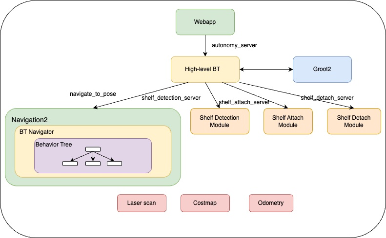

# Autonomous Shelf Detection in a Mobile Robot using the Behavior Tree

[](https://drive.google.com/file/d/1ekwW4uKgPeih__PlYYV_i0TOo5S9DcJ7/view?usp=sharing "rb1 demo")

This project is to develop a complex behavior based on multiple simpler behaviors using the behavior tree.
The behavior consists of 

1. detect a shelf anywhere in the warehouse
2. get underneath the shelf and use the elevator to pick it up
3. place the shelf at a desired location

Thanks to the [BT.CPP](https://github.com/BehaviorTree/BehaviorTree.CPP/tree/master) and [BehaviorTree.ROS2](https://github.com/BehaviorTree/BehaviorTree.ROS2) libraries, the complex behavior can be achieved.
This project is based on ROS2 Humble middleware.

## Software Architecture



## Dependencies

ROS2 Humble | Ubuntu 22.04 (Jammy) | CPU Architecture: amd64

## Compile

**Robot Simulation**

```
cd {simulation workspace}/src
git clone -b simulation --recurse-submodules https://github.com/ptientho/RB-1-warehouse-navigation.git
```
Build the package
```
cd {simulation workspace}
colcon build
```

**Project source codes**

```
cd {ros2 workspace}/src
git clone -b main --recurse-submodules https://github.com/ptientho/RB-1-warehouse-navigation.git
colcon build
```
Build the package
```
cd {ros2 workspace}
colcon build
```

**Web application**

```
cd {webapp workspace}
git clone -b webapp --recurse-submodules https://github.com/ptientho/RB-1-warehouse-navigation.git
```

## Run the application: simulation

**Gazebo Simulation**


```
source ~/your-simulation-workspace/install/setup.bash
ros2 launch the_construct_office_gazebo warehouse_rb1.launch.xml
```

**Navigation Server**

```
ros2 launch path_planner_server navigation.launch.py
```

**Rviz**

```
ros2 launch path_planner_server rviz.launch.py
```

**Shelf Servers**

```
ros2 launch rb1_autonomy shelf_servers.launch.py
```

**Autonomy Server**

```
ros2 launch rb1_autonomy autonomy.launch.py
```

**Web Application**

```
cd ~/your-webpage-workspace/RB-1-warehouse-navigation/rb1_webapp/
python3 -m http.server 7000
```

In a new terminal, run

```
ros2 launch rosbridge_server rosbridge_websocket_launch.xml
```

## Run the application: real robot

Make sure to connect the real robot.

**Navigation Server**

```
ros2 launch path_planner_server navigation_real.launch.py
```

**Rviz**

```
ros2 launch path_planner_server rviz.launch.py
```

**Shelf Servers**

```
ros2 launch rb1_autonomy shelf_servers_real.launch.py
```

**Autonomy Server**

```
ros2 launch rb1_autonomy autonomy_real.launch.py
```

**Web Application**

```
cd ~/your-webpage-workspace/RB-1-warehouse-navigation/rb1_webapp/
python3 -m http.server 7000
```

In a new terminal, run

```
ros2 launch rosbridge_server rosbridge_websocket_launch.xml
```

## Groot2 Visualization

Download the installer from [Groot2 installer](https://www.behaviortree.dev/groot).
Open the project file inside Groot2 software and browse for a file name ```bt_real_project.btproj```.


